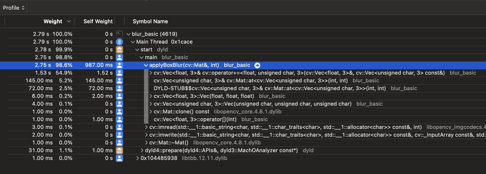

# Hardware Accelerated Image Processing with Metal

This project compares the performance of a box blur algorithm implemented in plain C++, using OpenCV and on Apple's Metal GPU framework.

| Implementation | Blur Time (ms) |
|----------------|----------------|
| (1) Basic C++      | 2753           |
| (2) C++ & OpenCV   | 31             |
| (3) Swift & Metal  | 11             |

Blurring [input.jpg](input.jpg) with a uniform 19x19 kernel, setup and IO times excluded. (1) and (3) use the same algorithm, (2) uses OpenCV's `filter2d`.

## Dependencies
- OpenCV
- `swiftc` compiler, part of Xcode on macOS

```bash
brew install opencv
```

## Build and Run
```bash
make all
./build/blur_basic
```
(uses Xcode's `swiftc` compiler for swift source)

## Input and Output


## Analyse
With macOS's `xctrace` tool and Xcode's Instruments.

```bash
xctrace record --launch -- ./build/blur_basic
```
(equivalent to the `perf` tool on Linux)

### Xcode Instrument's Trace
The trace shows the time spent in the `applyBoxBlur` function in the basic C++ implementation.



### Full Results
Swift with Metal crushes the C++ implementation of the same algorithm. OpenCV performs much closer to the Metal implementation, but still lags behind. It probably uses a better convolution algorithm.

| Implementation | Setup | Read |   Blur   | Write | Total |
|----------------|-------|------|----------|-------|-------|
| Basic C++      | -     | 3    | **2753** | 2     | 2758  |
| OpenCV         | -     | 3    | **31**   | 2     | 36    |
| Metal          | 63    | 20   | **11**   | 4     | 98    |

Times are measured with timing calls on the CPU, see source code.
